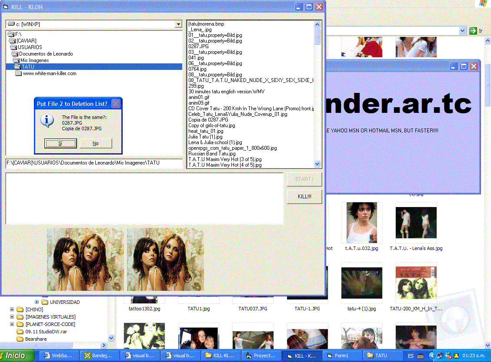



## \[    a\- Intelligent File Comparer \(UPDATED WITH PROGRESS BAR\!\!\!\)    \]

### Description

Very useful when you use cazaa or Bearshare or other P2p, where you download infinity of files, but a quarter is duplicated. It compares all type of files looking for duplicates, how? you select a folder, all files in that folder will be checked and compared looking for duplicated files, it checks 3 part of the binarys and the file LEN, if a file seems to be equal to other, the programm promts for action, and shows if the file is the same.

It's like that programm of NORTON... i don't remember the name.

it uses listbox, drive list, progressbar, textbox and dir list. Uses two Binary access.

NOW UPDATED WITH PROGRESS BAR!!!!!!!!!!
 
### More Info
 
A folder

The file opened must be at least bigger than 1024 Bytes(1kb).

A list of files to delete if they are duplicated.

none, it works GREAT!, may fail with GIF files, but for that reason there is a Picture box, you decide if the file is the same.

             |
---                |---
**Submitted On**   |2004-04-07 00:29:38
**By**             |[FUCCI, Leonardo Hernan](https://github.com/Planet-Source-Code/PSCIndex/blob/master/ByAuthor/fucci-leonardo-hernan.md)
**Level**          |Advanced
**User Rating**    |4.2 (25 globes from 6 users)
**Compatibility**  |VB 4\.0 \(32\-bit\), VB 5\.0, VB 6\.0
**Category**       |[Files/ File Controls/ Input/ Output](https://github.com/Planet-Source-Code/PSCIndex/blob/master/ByCategory/files-file-controls-input-output__1-3.md)
**World**          |[Visual Basic](https://github.com/Planet-Source-Code/PSCIndex/blob/master/ByWorld/visual-basic.md)
**Archive File**   |[a\-\_Intelli172996462004\.zip](https://github.com/Planet-Source-Code/fucci-leonardo-hernan-a-intelligent-file-comparer-updated-with-progress-bar__1-52914/archive/master.zip)

